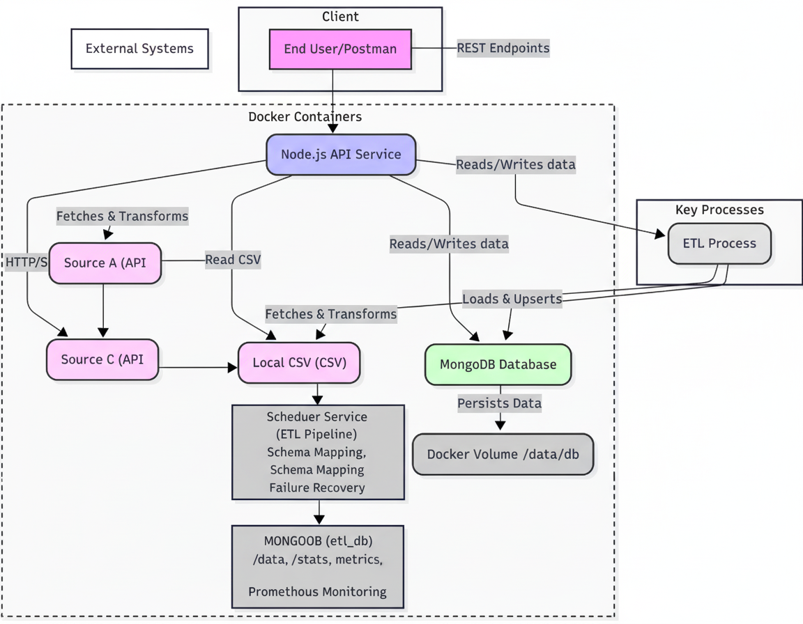

Kasparro ETL System

A resilient Market Data ETL and API service built with Node.js, Express, and MongoDB, fully containerized with Docker. This project ingests data from multiple sources (public APIs and CSV files), normalizes it, and serves it via a RESTful API while handling failures gracefully.

🚀 How to Run

Follow these steps to build, configure, and run the application locally.

1. Prerequisites

Docker

Docker Compose (usually included with Docker Desktop)

Git
2. Clone the Repository
https://github.com/koushikbs407/Etl_Service.git

Configure Environment Variables

Create a .env file based on the example:

cp .env.example .env

Edit .env to include your database credentials and any API keys:

PORT=3000
MONGODB_URI=mongodb://mongodb:27017/etl_db
ALERT_EMAIL_USER=youremail@example.com
ALERT_EMAIL_PASS=yourEmailPassword

4. Build and Start the Services
docker-compose up -d --build

The -d flag runs containers in the background.

5. Trigger the Initial ETL

The database starts empty. Trigger the ETL process manually:

curl -X POST http://localhost:3000/refresh \
  -H "Content-Type: application/json"

The ETL process will then run automatically every hour.

⚙️ API Usage
Health Check

Request: GET /health

Description: Reports the status of the API, MongoDB, and Scheduler services.

Trigger ETL

Request: POST /refresh

Description: Manually triggers a new ETL run.

Get ETL Statistics

Request: GET /stats

Description: Returns metadata about ETL runs, including record count, last successful run, and error rates.

Fetch Normalized Data

Request: GET /data

Description: Fetch normalized market data with filtering, sorting, and pagination.

Query Parameters:

Parameter	Description
symbol	Filter by a specific stock/crypto symbol (e.g., BTC)
sortBy	Sort results (e.g., price_usd:desc)
page	Page number for pagination
limit	Number of results per page

🏗️ Architecture

The system consists of two main services managed via Docker Compose:

API Service (api)

Node.js & Express server

Exposes REST API endpoints

Contains the scheduler to trigger ETL

Database Service (mongodb)

Stores raw and normalized data

Stores ETL metadata, logs, and checkpoint

Resilience & Recovery

Idempotency

Upsert operations with unique hash keys prevent duplicate records

Re-running failed jobs is safe

Rate Limiting

API calls automatically retry with exponential backoff if throttled

Schema Drift Handling

Checks for variations in column names

Logs warnings without crashing

